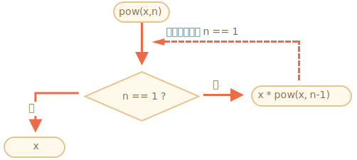

# 遞迴與堆疊

讓我們一起回顧函數並更深入地研究它們。

我們首先要探討的主題是*遞迴*。

如果你曾接觸過程式設計，你可能對此不陌生，可以考慮跳過這一章。

Recursion is a programming pattern that is useful in situations when a task can be naturally split into several tasks of the same kind, but simpler. Or when a task can be simplified into an easy action plus a simpler variant of the same task. Or, as we'll see soon, to deal with certain data structures.

當我們遇到的問題可以被自然地拆解為數個同類型但更簡單的子問題、或者被視為一個同類型但更簡單的子問題配上一個非同類但特別簡單的子問題、或者，則遞迴將是一個合適的設計模式。

一個函數在處理問題的過程中可以呼叫更多函數，特別地，一個函數可以呼叫*自己*，這就稱作*遞迴*。

## 兩種思路

簡單起見，我們來實現冪函數 `pow(x, n)`，它會計算 `x` 的 `n` 次冪，也就是將 `x` 自乘 `n` 次。

```js
pow(2, 2) = 4
pow(2, 3) = 8
pow(2, 4) = 16
```

冪函數的實作有兩種。

1. 迭代的思路：`for` 迴圈：


    ```js run
    function pow(x, n) {
      let result = 1;

      // 於每一層迴圈（共 n 層）將 result 乘以 x
      for (let i = 0; i < n; i++) {
        result *= x;
      }

      return result;
    }

    alert( pow(2, 3) ); // 8
    ```

2. 遞迴的思路：簡化問題並呼叫自己：

    ```js run
    function pow(x, n) {
      if (n == 1) {
        return x;
      } else {
        return x * pow(x, n - 1);
      }
    }

    alert( pow(2, 3) ); // 8
    ```

請注意遞迴跟迭代本質上的區別。

當 `pow(x, n)` 被呼叫時，有兩個執行途徑（分支）。

```js
              if n==1  = x
             /
pow(x, n) =
             \       
              else     = x * pow(x, n - 1)
```

1. 若 `n == 1`，情況特別簡單。這個分支稱作遞迴的*基楚支*，因為它是這個問題最簡單的形式：`pow(x, 1)` 即 `x`。

2. 否則，`pow(x, n)` 總可以退化為 `x * pow(x, n - 1)`，用常見的數學符號表示即 <code>x<sup>n</sup> = x * x<sup>n-1</sup></code> 。這個分支稱作遞迴的*遞迴支*：我們將問題改寫為一個很單純的運算（乘以x）和一個同類型但更簡單的問題（計算更小的次冪）。之後的幾次遞迴將不斷簡化問題直至 `n` 降為 `1`。

We can also say that `pow` *recursively calls itself* till `n == 1`.

我們也可以說 `pow` *遞迴地呼叫自己* 直至 `n == 1`。




For example, to calculate `pow(2, 4)` the recursive variant does these steps:

例如，遞迴版本的實作在計算 `pow(2, 4)` 的過程中執行了：

1. `pow(2, 4) = 2 * pow(2, 3)`
2. `pow(2, 3) = 2 * pow(2, 2)`
3. `pow(2, 2) = 2 * pow(2, 1)`
4. `pow(2, 1) = 2`

故，遞迴將一個函數呼叫簡化成更簡單的函數呼叫，再將之進一步簡化，以此類推，直到結果變得顯然。

````smart header="遞迴通常更短"
A recursive solution is usually shorter than an iterative one.

遞迴版本的實作通常比迭代的短。

Here we can rewrite the same using the conditional operator `?` instead of `if` to make `pow(x, n)` more terse and still very readable:

承接上例，我們可以用條件運算元 `?` 取代 `if` 使 `pow(x, n)` 更加精煉又不失可讀性。

```js run
function pow(x, n) {
  return (n == 1) ? x : (x * pow(x, n - 1));
}
```
````

巢狀呼叫次數（包含首次）的上限稱作*遞迴深度*。此例中，遞迴深度是 `n`。

遞迴深度受限於 JavaScript 引擎。10000 是遞迴深度的可靠估計，雖然有些引擎支援更多，但多數引擎的支援比 10000 少。有些引擎的自動優化 ("tail calls optimizations") 可以避開遞迴深度的限制，但這類技術的支援還不夠廣泛且只適用於簡單的情境。

這在某個程度上限制了遞迴的應用，但事實上遞迴的應用依然很廣。對於很多問題，遞迴的思維使程式碼更簡潔、更易維護。

## 執行脈絡與堆疊

現在我們來檢視遞迴呼叫如何運作。為此，我們先檢視函數的運作原理。

關於一個函數執行過程的資訊存於其*執行脈絡*中。

[執行脈絡](https://tc39.github.io/ecma262/#sec-execution-contexts) 是一種內部資料結構，它存有一個函數執行的細節：控制流程當前的進度、現有的變數、`this` 的值（我們暫且不提）以及其他一些內部細節。

一個函數呼叫洽對應到一個執行脈絡。

若當前函數發起一個巢狀呼叫，將觸發以下事件：

- 暫停當前函數的執行。
- 將當前函數的執行脈絡存於一個叫*執行脈絡堆疊*的特殊資料結構中。
- 執行巢狀呼叫。
- 當巢狀呼叫執行完成，從執行脈絡堆疊中取出發起該巢狀呼叫的函數執行脈絡，並恢復其執行。

我們來觀察呼叫 `pow(2, 3)` 會發生什麼事。

### pow(2, 3)

呼叫 `pow(2, 3)` 的一開始，其執行脈絡存有變數：`x = 2, n = 3`，以及執行流程達到函數的第 `1` 行。

可以如此描述：

<ul class="function-execution-context-list">
  <li>
    <span class="function-execution-context">Context: { x: 2, n: 3, at line 1 }</span>
    <span class="function-execution-context-call">pow(2, 3)</span>
  </li>
</ul>

那是當函數剛開始執行時的情況。因為 `n == 1` 不成立，所以流程會進入 `if` 的第二個分支：

```js run
function pow(x, n) {
  if (n == 1) {
    return x;
  } else {
*!*
    return x * pow(x, n - 1);
*/!*
  }
}

alert( pow(2, 3) );
```


變數的值沒變，但流程向前推進了，故，執行脈絡變成：

<ul class="function-execution-context-list">
  <li>
    <span class="function-execution-context">Context: { x: 2, n: 3, at line 5 }</span>
    <span class="function-execution-context-call">pow(2, 3)</span>
  </li>
</ul>

為計算 `x * pow(x, n - 1)`，我們必須巢狀呼叫被傳入新參數的 `pow` 即 `pow(2, 2)`。

### pow(2, 2)

為了巢狀呼叫，JavaScript 會將當前的執行脈絡存入*執行脈絡堆疊*。

此例中我們呼叫同一個函數 `pow`，但這不要緊，不論呼叫哪個函數這個過程依舊是：

1. 當前的執行脈絡被記錄在執行脈絡堆疊頂端。
2. 為巢狀呼叫產生一個新的執行脈絡。
3. 當巢狀呼叫完成，從執行脈絡堆疊取出先前的執行脈絡，並恢復先前函數的執行。

巢狀呼叫 `pow(2, 2)` 會更新執行脈絡堆疊：

<ul class="function-execution-context-list">
  <li>
    <span class="function-execution-context">Context: { x: 2, n: 2, at line 1 }</span>
    <span class="function-execution-context-call">pow(2, 2)</span>
  </li>
  <li>
    <span class="function-execution-context">Context: { x: 2, n: 3, at line 5 }</span>
    <span class="function-execution-context-call">pow(2, 3)</span>
  </li>
</ul>

新的執行脈絡在上（粗體），先前存入的執行脈絡在下。

當巢狀呼叫執行完成，要恢復之前的執行相當容易，因為執行脈絡存有那兩個變數和之前停下時的流程進度。

```smart
在之前幾張執行脈絡堆疊的示意圖中，我們之所以使用 "行" ("line") 表示流程進度是因為在此例中，每行程式碼至多只有一個巢狀呼叫，但一般而言，一行程式碼可能包含數個巢狀呼叫，如 `pow(…) + pow(…) + somethingElse(…)`。

故，說執行是 "立即於巢狀呼叫完成後" 恢復的會更準確。
```

### pow(2, 1)

重複此過程：於第 `5` 行發起新的巢狀呼叫，這次變數是 `x=2, n=1`。

產生一個新的執行脈絡，並將先前的執行脈絡加入執行脈絡堆疊頂端：

<ul class="function-execution-context-list">
  <li>
    <span class="function-execution-context">Context: { x: 2, n: 1, at line 1 }</span>
    <span class="function-execution-context-call">pow(2, 1)</span>
  </li>
  <li>
    <span class="function-execution-context">Context: { x: 2, n: 2, at line 5 }</span>
    <span class="function-execution-context-call">pow(2, 2)</span>
  </li>
  <li>
    <span class="function-execution-context">Context: { x: 2, n: 3, at line 5 }</span>
    <span class="function-execution-context-call">pow(2, 3)</span>
  </li>
</ul>

現在有兩個舊的執行脈絡和當前 `pow(2, 1)` 的執行脈絡。

### 退離

執行 `pow(2, 1)` 時，有別於故，`n == 1` 是個 truthy 條件，所以流程會進入 `if` 的第一個分支：

```js
function pow(x, n) {
  if (n == 1) {
*!*
    return x;
*/!*
  } else {
    return x * pow(x, n - 1);
  }
}
```

再也沒有巢狀呼叫了，函數退離並 `2` 回傳。

隨著函數退離，其執行脈絡將不再被需要，因此被從記憶體中移除。從堆疊頂端取回先前的執行脈絡。

<ul class="function-execution-context-list">
  <li>
    <span class="function-execution-context">Context: { x: 2, n: 2, at line 5 }</span>
    <span class="function-execution-context-call">pow(2, 2)</span>
  </li>
  <li>
    <span class="function-execution-context">Context: { x: 2, n: 3, at line 5 }</span>
    <span class="function-execution-context-call">pow(2, 3)</span>
  </li>
</ul>

恢復 `pow(2, 2)` 的執行。它有了巢狀呼叫 `pow(2, 1)` 的結果，因此可以完成運算 `x * pow(x, n - 1)` 並回傳 `4`。

然後，再更之前的執行脈絡被取回：

<ul class="function-execution-context-list">
  <li>
    <span class="function-execution-context">Context: { x: 2, n: 3, at line 5 }</span>
    <span class="function-execution-context-call">pow(2, 3)</span>
  </li>
</ul>

當它退離，我們便有結果 `pow(2, 3) = 8`。

此例的遞迴深度是：**3**。

由上述可知，遞迴深度等同堆疊中執行脈絡的最大數量。

請注意記憶體需求。執行脈絡占用記憶體。此例中，計算 `n` 次冪共消耗了 `n` 個執行脈絡所需的空間，分別對應到一個不超過 `n` 的自然數。

基於迴圈的算法更省記憶體：

```js
function pow(x, n) {
  let result = 1;

  for (let i = 0; i < n; i++) {
    result *= x;
  }

  return result;
}
```

基於迭代的 `pow` 只需要一個執行脈絡用於修改 `i` 和 `result`。記憶體要求低且固定，並不依賴於 `n`。

**遞迴都可已改寫成迴圈。基於迴圈的實作通常較有效。**

...But sometimes the rewrite is non-trivial, especially when function uses different recursive subcalls depending on conditions and merges their results or when the branching is more intricate. And the optimization may be unneeded and totally not worth the efforts.

...但有時候重寫不容易，特別是當

基於遞迴的程式碼一般都較短、易懂、且易於維護。我們不需要處處優化，需要的更多是優良的程式碼，這也是為什麼遞迴會被使用。

## 遞迴巡訪

Another great application of the recursion is a recursive traversal.

遞迴的另一重大應用便是遞迴巡訪。

Imagine, we have a company. The staff structure can be presented as an object:

想像我們有家公司，人力組織可表示為一個物件：

```js
let company = {
  sales: [{
    name: 'John',
    salary: 1000
  }, {
    name: 'Alice',
    salary: 1600
  }],

  development: {
    sites: [{
      name: 'Peter',
      salary: 2000
    }, {
      name: 'Alex',
      salary: 1800
    }],

    internals: [{
      name: 'Jack',
      salary: 1300
    }]
  }
};
```

In other words, a company has departments.

換句話說，一個公司有多個部門。

- A department may have an array of staff. For instance, `sales` department has 2 employees: John and Alice.
- Or a department may split into subdepartments, like `development` has two branches: `sites` and `internals`. Each of them has their own staff.
- It is also possible that when a subdepartment grows, it divides into subsubdepartments (or teams).

    For instance, the `sites` department in the future may be split into teams for `siteA` and `siteB`. And they, potentially, can split even more. That's not on the picture, just something to have in mind.

Now let's say we want a function to get the sum of all salaries. How can we do that?

An iterative approach is not easy, because the structure is not simple. The first idea may be to make a `for` loop over `company` with nested subloop over 1st level departments. But then we need more nested subloops to iterate over the staff in 2nd level departments like `sites`... And then another subloop inside those for 3rd level departments that might appear in the future? If we put 3-4 nested subloops in the code to traverse a single object, it becomes rather ugly.

Let's try recursion.

As we can see, when our function gets a department to sum, there are two possible cases:

1. Either it's a "simple" department with an *array* of people -- then we can sum the salaries in a simple loop.
2. Or it's *an object* with `N` subdepartments -- then we can make `N` recursive calls to get the sum for each of the subdeps and combine the results.

The 1st case is the base of recursion, the trivial case, when we get an array.

The 2nd case when we get an object is the recursive step. A complex task is split into subtasks for smaller departments. They may in turn split again, but sooner or later the split will finish at (1).

The algorithm is probably even easier to read from the code:


```js run
let company = { // the same object, compressed for brevity
  sales: [{name: 'John', salary: 1000}, {name: 'Alice', salary: 1600 }],
  development: {
    sites: [{name: 'Peter', salary: 2000}, {name: 'Alex', salary: 1800 }],
    internals: [{name: 'Jack', salary: 1300}]
  }
};

// The function to do the job
*!*
function sumSalaries(department) {
  if (Array.isArray(department)) { // case (1)
    return department.reduce((prev, current) => prev + current.salary, 0); // sum the array
  } else { // case (2)
    let sum = 0;
    for (let subdep of Object.values(department)) {
      sum += sumSalaries(subdep); // recursively call for subdepartments, sum the results
    }
    return sum;
  }
}
*/!*

alert(sumSalaries(company)); // 7700
```

The code is short and easy to understand (hopefully?). That's the power of recursion. It also works for any level of subdepartment nesting.

Here's the diagram of calls:


We can easily see the principle: for an object `{...}` subcalls are made, while arrays `[...]` are the "leaves" of the recursion tree, they give immediate result.

Note that the code uses smart features that we've covered before:

- Method `arr.reduce` explained in the chapter <info:array-methods> to get the sum of the array.
- Loop `for(val of Object.values(obj))` to iterate over object values: `Object.values` returns an array of them.


## Recursive structures

A recursive (recursively-defined) data structure is a structure that replicates itself in parts.

We've just seen it in the example of a company structure above.

A company *department* is:
- Either an array of people.
- Or an object with *departments*.

For web-developers there are much better-known examples: HTML and XML documents.

In the HTML document, an *HTML-tag* may contain a list of:
- Text pieces.
- HTML-comments.
- Other *HTML-tags* (that in turn may contain text pieces/comments or other tags etc).

That's once again a recursive definition.

For better understanding, we'll cover one more recursive structure named "Linked list" that might be a better alternative for arrays in some cases.

### Linked list

Imagine, we want to store an ordered list of objects.

The natural choice would be an array:

```js
let arr = [obj1, obj2, obj3];
```

...But there's a problem with arrays. The "delete element" and "insert element" operations are expensive. For instance, `arr.unshift(obj)` operation has to renumber all elements to make room for a new `obj`, and if the array is big, it takes time. Same with `arr.shift()`.

The only structural modifications that do not require mass-renumbering are those that operate with the end of array: `arr.push/pop`. So an array can be quite slow for big queues, when we have to work with the beginning.

Alternatively, if we really need fast insertion/deletion, we can choose another data structure called a [linked list](https://en.wikipedia.org/wiki/Linked_list).

The *linked list element* is recursively defined as an object with:
- `value`.
- `next` property referencing the next *linked list element* or `null` if that's the end.

For instance:

```js
let list = {
  value: 1,
  next: {
    value: 2,
    next: {
      value: 3,
      next: {
        value: 4,
        next: null
      }
    }
  }
};
```

Graphical representation of the list:


An alternative code for creation:

```js no-beautify
let list = { value: 1 };
list.next = { value: 2 };
list.next.next = { value: 3 };
list.next.next.next = { value: 4 };
list.next.next.next.next = null;
```

Here we can even more clearly see that there are multiple objects, each one has the `value` and `next` pointing to the neighbour. The `list` variable is the first object in the chain, so following `next` pointers from it we can reach any element.

The list can be easily split into multiple parts and later joined back:

```js
let secondList = list.next.next;
list.next.next = null;
```


To join:

```js
list.next.next = secondList;
```

And surely we can insert or remove items in any place.

For instance, to prepend a new value, we need to update the head of the list:

```js
let list = { value: 1 };
list.next = { value: 2 };
list.next.next = { value: 3 };
list.next.next.next = { value: 4 };

*!*
// prepend the new value to the list
list = { value: "new item", next: list };
*/!*
```


To remove a value from the middle, change `next` of the previous one:

```js
list.next = list.next.next;
```


We made `list.next` jump over `1` to value `2`. The value `1` is now excluded from the chain. If it's not stored anywhere else, it will be automatically removed from the memory.

Unlike arrays, there's no mass-renumbering, we can easily rearrange elements.

Naturally, lists are not always better than arrays. Otherwise everyone would use only lists.

The main drawback is that we can't easily access an element by its number. In an array that's easy: `arr[n]` is a direct reference. But in the list we need to start from the first item and go `next` `N` times to get the Nth element.

...But we don't always need such operations. For instance, when we need a queue or even a [deque](https://en.wikipedia.org/wiki/Double-ended_queue) -- the ordered structure that must allow very fast adding/removing elements from both ends, but access to its middle is not needed.

Lists can be enhanced:
- We can add property `prev` in addition to `next` to reference the previous element, to move back easily.
- We can also add a variable named `tail` referencing the last element of the list (and update it when adding/removing elements from the end).
- ...The data structure may vary according to our needs.

## Summary

Terms:
- *Recursion*  is a programming term that means calling a function from itself. Recursive functions can be used to solve tasks in elegant ways.

    When a function calls itself, that's called a *recursion step*. The *basis* of recursion is function arguments that make the task so simple that the function does not make further calls.

- A [recursively-defined](https://en.wikipedia.org/wiki/Recursive_data_type) data structure is a data structure that can be defined using itself.

    For instance, the linked list can be defined as a data structure consisting of an object referencing a list (or null).

    ```js
    list = { value, next -> list }
    ```

    Trees like HTML elements tree or the department tree from this chapter are also naturally recursive: they branch and every branch can have other branches.

    Recursive functions can be used to walk them as we've seen in the `sumSalary` example.

Any recursive function can be rewritten into an iterative one. And that's sometimes required to optimize stuff. But for many tasks a recursive solution is fast enough and easier to write and support.
